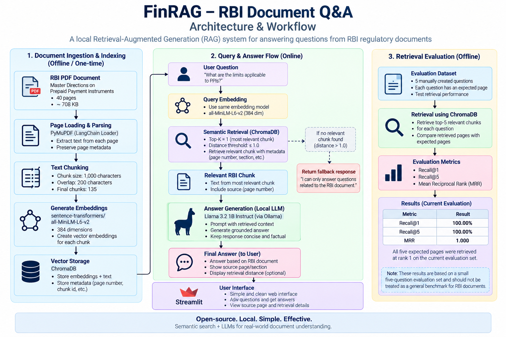

# 🏦 FinRAG — RBI Document Q&A

A local Retrieval-Augmented Generation (RAG) system for answering questions from an **RBI regulatory document** using semantic retrieval and a small local LLM.

The system processes the RBI PDF into searchable chunks, converts them into **Sentence Transformer embeddings**, stores them in **ChromaDB**, retrieves relevant context for a user query, and generates a grounded answer using **Llama 3.2 1B through Ollama**.

### Key Highlights

- **Document:** RBI Master Directions on Prepaid Payment Instruments
- **Document size:** 40 pages
- **Final chunks:** 135
- **Chunking:** 1,000 characters with 200-character overlap
- **Embedding model:** `sentence-transformers/all-MiniLM-L6-v2`
- **Embedding dimension:** 384
- **Vector database:** ChromaDB
- **Retrieval:** Top-1 semantic search with distance threshold
- **LLM:** Llama 3.2 1B running locally through Ollama
- **Interface:** Streamlit
- **Retrieval evaluation:** Recall@1, Recall@5 and MRR
- **Evaluation questions:** 5

### Retrieval Results

| Metric | Result |
|---|---:|
| Recall@1 | 100.00% |
| Recall@5 | 100.00% |
| MRR | 1.000 |

All five expected pages were retrieved at rank 1 on the current evaluation set.

> **Evaluation note:** These results are based on a small five-question evaluation set and should not be treated as a general benchmark for RBI documents.

---

## What I Built

The application follows a simple RAG pipeline:

```text
RBI PDF
   ↓
Load Pages
   ↓
Chunk Documents
   ↓
Create Embeddings
   ↓
Store in ChromaDB
   ↓
Retrieve Relevant Chunk
   ↓
Llama 3.2 1B
   ↓
Answer
```

---

## Technologies

- Python
- PyMuPDF
- LangChain
- Sentence Transformers
- ChromaDB
- Ollama
- Llama 3.2 1B
- Streamlit

---

## Why RAG?

Instead of sending the entire RBI PDF to the LLM, the application first searches the document for the most relevant information.

For each question:

1. Convert the question into an embedding.
2. Search ChromaDB for similar document chunks.
3. Reject chunks that are above the configured distance threshold.
4. Pass the relevant chunk to the local LLM.
5. Generate an answer using only the retrieved RBI context.

This keeps the LLM context small, focused, and grounded in the document.

---
## Architecture

The system follows a simple local RAG pipeline with separate flows for document indexing, question answering, and retrieval evaluation.



### Query Flow

1. The user enters an RBI-related question.
2. The question is converted into an embedding using `all-MiniLM-L6-v2`.
3. ChromaDB performs semantic similarity search.
4. The application retrieves the top-ranked chunk.
5. Results with a distance greater than `1.0` are rejected.
6. The relevant RBI context is passed to Llama 3.2 1B through Ollama.
7. The generated answer and source information are displayed through Streamlit.

### Evaluation Flow

The retrieval evaluation uses the same embedding model and ChromaDB collection, but retrieves the top 5 results for each evaluation question.

The system measures:

- Recall@1
- Recall@5
- Mean Reciprocal Rank (MRR)
---

## Document

The project currently uses an RBI document related to **Prepaid Payment Instruments (PPIs)**.

| Property | Value |
|---|---|
| Document format | PDF |
| Pages | 40 |

The PDF is loaded page by page so that the original page number can be preserved as metadata.

---

## Chunking

Each page is split into smaller chunks before creating embeddings.

The final configuration was selected after testing three different chunk sizes.

| Chunk Size | Overlap | Chunks | Recall@1 | Recall@5 | MRR |
|---:|---:|---:|---:|---:|---:|
| 500 | 100 | 266 | 80.00% | 100.00% | 0.900 |
| 1000 | 200 | 135 | 100.00% | 100.00% | 1.000 |
| 1500 | 300 | 95 | 60.00% | 80.00% | 0.640 |

The **1000-character configuration** performed best on the evaluation set.

### Final Configuration

```text
Chunk size    : 1000 characters
Chunk overlap : 200 characters
Pages         : 40
Chunks        : 135
```

The overlap helps preserve context when information continues across chunk boundaries.

---

## Embeddings

The project uses:

```text
sentence-transformers/all-MiniLM-L6-v2
```

### Embedding Dimension

```text
384
```

The embeddings allow the system to search for information based on semantic similarity rather than only exact keyword matches.

---

## Vector Database

**ChromaDB** is used as the local vector database.

```text
Collection : rbi_documents
Chunks     : 135
```

The vector database is generated locally and is excluded from Git.

---

## Retrieval

The question is converted into an embedding and searched against the ChromaDB collection.

### Final Retrieval Configuration

```text
Top K              : 1
Distance threshold : 1.0
```

ChromaDB returns a distance value for each result.

```text
Lower distance  → More similar
Higher distance → Less similar
```

Only results satisfying:

```text
distance <= 1.0
```

are passed to the LLM.

This threshold helps prevent unrelated questions from reaching the answer-generation stage.

For example, an RBI question can produce a low distance such as:

```text
0.6151
```

while unrelated questions such as:

```text
What is the capital of France?
```

produce a much higher distance and are rejected.

---

## Answer Generation

The final answer is generated using:

```text
Llama 3.2 1B
llama3.2:1b-instruct-q3_K_M
```

The model runs locally through **Ollama**.

The model is intentionally small so that the application can run on CPU-based systems without requiring a large GPU.

The prompt instructs the model to:

- Use only the retrieved RBI text
- Answer directly
- Avoid outside knowledge
- Avoid inventing information
- Keep the answer concise

### Example

**Question**

> What is the maximum amount that can be loaded into such PPIs during a month?

**Retrieved context**

```text
Amount loaded in such PPIs during any month shall not exceed
Rs.10,000/-
```

**Answer**

> The maximum amount that can be loaded into such PPIs during a month is Rs.10,000.

---

## Handling Unrelated Questions

The system is designed to avoid answering questions that are unrelated to the RBI document.

For example:

```text
What is the capital of France?
```

The retrieval distance is above the configured threshold.

Therefore, the question is rejected before answer generation:

```text
I could not find the answer in the provided RBI document.
```

This keeps the application grounded in the retrieved RBI content.

---

## Streamlit Application

A simple Streamlit interface is included.

Run:

```bash
streamlit run app/streamlit_app.py
```

The application allows the user to:

- Enter an RBI question
- Retrieve the relevant RBI chunk
- Generate an answer locally
- See the RBI page used as the source
- See the retrieval distance

---

## Evaluation

The retrieval system was evaluated using five questions based on the RBI document.

The evaluation questions cover:

1. Monthly PPI loading limit
2. PPI outstanding limit
3. Monthly funds transfer limit
4. Cash withdrawal limit
5. Definition of PPI Holder

### Retrieval Evaluation

Run:

```bash
python evaluation/evaluate_retrieval.py
```

Result:

```text
Correct: 5/5
Recall@5: 100.00%
```

### Ranking Evaluation

Run:

```bash
python evaluation/evaluate_ranking.py
```

Result:

```text
Recall@1 : 100.00%
Recall@5 : 100.00%
MRR      : 1.000
```

All five expected pages were retrieved at rank 1.

### Final Evaluation Summary

| Metric | Result |
|---|---:|
| Evaluation questions | 5 |
| Recall@1 | 100.00% |
| Recall@5 | 100.00% |
| MRR | 1.000 |
| Document pages | 40 |
| Final chunks | 135 |

These results are based on the current evaluation set and should not be considered a general benchmark for all RBI documents.

---

## Project Structure

```text
finrag-rbi-document-qa/
│
├── app/
│   └── streamlit_app.py
│
├── data/
│   └── documents/
│       └── rbi_prepaid_payment_instruments.pdf
│
├── evaluation/
│   ├── questions.json
│   ├── evaluate_retrieval.py
│   ├── evaluate_ranking.py
│   └── chunking_experiment.py
│
├── screenshots/
│   ├── application/
│   ├── retrieval/
│   ├── evaluation/
│   └── chunking/
│
├── src/
│   ├── load_documents.py
│   ├── chunk_documents.py
│   ├── build_vector_db.py
│   ├── retrieve.py
│   └── generate_answer.py
│
├── .gitignore
├── README.md
└── requirements.txt
```

---

## Installation

### 1. Clone the Repository

```bash
git clone https://github.com/Mohanaspiringcoder/finrag-rbi-document-qa.git
cd finrag-rbi-document-qa
```

### 2. Create a Virtual Environment

```bash
python3 -m venv .venv
source .venv/bin/activate
```

### 3. Install Dependencies

```bash
pip install -r requirements.txt
```

### 4. Install and Run Ollama

Install Ollama for your operating system, then pull the local model:

```bash
ollama pull llama3.2:1b-instruct-q3_K_M
```

Verify:

```bash
ollama list
```

---

## Run the Project

Run these steps in order.

### 1. Load the Document

```bash
python src/load_documents.py
```

Expected:

```text
Number of pages loaded: 40
```

### 2. Create Chunks

```bash
python src/chunk_documents.py
```

Expected:

```text
Pages loaded: 40
Chunks created: 135
```

### 3. Build the Vector Database

```bash
python src/build_vector_db.py
```

Expected:

```text
Embeddings shape: (135, 384)
Stored chunks: 135
```

### 4. Test Retrieval

```bash
python src/retrieve.py
```

### 5. Run Terminal Q&A

```bash
python -m src.generate_answer
```

### 6. Run Streamlit

```bash
streamlit run app/streamlit_app.py
```

---

## Run Evaluation

### Retrieval

```bash
python evaluation/evaluate_retrieval.py
```

### Ranking

```bash
python evaluation/evaluate_ranking.py
```

### Chunking Experiment

```bash
python evaluation/chunking_experiment.py
```

---

## Screenshots

Screenshots from the development and evaluation process are stored in:

```text
screenshots/
```

The folders contain examples of:

- Streamlit application
- Successful RBI question answering
- Rejection of unrelated questions
- Retrieval results
- Retrieval evaluation
- Ranking evaluation
- Chunking experiments

---

## Limitations

This is a small local RAG application, so there are several limitations:

- The evaluation set contains only five questions.
- Only one RBI document is currently indexed.
- The system retrieves only one chunk.
- Retrieval quality depends on the embedding model and chunking strategy.
- The 1B LLM may struggle with complex questions.
- Complex PDF tables and layouts may require better document parsing.
- The distance threshold was selected using the current document and evaluation set.

---

## Key Learnings

This project helped me understand the complete RAG pipeline from document ingestion to answer generation.

The main lessons were:

- Chunk size has a significant impact on retrieval quality.
- Smaller chunks do not always produce better retrieval.
- Chunk overlap helps preserve context across boundaries.
- Semantic search is useful for document question answering.
- Retrieval should be evaluated separately from answer generation.
- A small local LLM can work well when the retrieved context is relevant.
- A retrieval threshold can help prevent unrelated questions from reaching the LLM.
- Sending only relevant context keeps the LLM input smaller and focused.

---

## Future Improvements

Possible improvements include:

- Add more RBI documents.
- Expand the evaluation dataset.
- Retrieve multiple chunks for questions requiring information from different sections.
- Experiment with stronger embedding models.
- Add a reranking stage.
- Improve PDF and table extraction.
- Improve answer citations.
- Add document-level filtering.

---

## Final Configuration

| Component | Configuration |
|---|---|
| Document | RBI PPI document |
| Pages | 40 |
| Chunk size | 1000 characters |
| Chunk overlap | 200 characters |
| Chunks | 135 |
| Embedding model | all-MiniLM-L6-v2 |
| Embedding dimension | 384 |
| Vector database | ChromaDB |
| Top K | 1 |
| Distance threshold | 1.0 |
| LLM | Llama 3.2 1B |
| LLM runtime | Ollama |
| Interface | Streamlit |

---

## Author

**Mohan**

GitHub: [@Mohanaspiringcoder](https://github.com/Mohanaspiringcoder)
