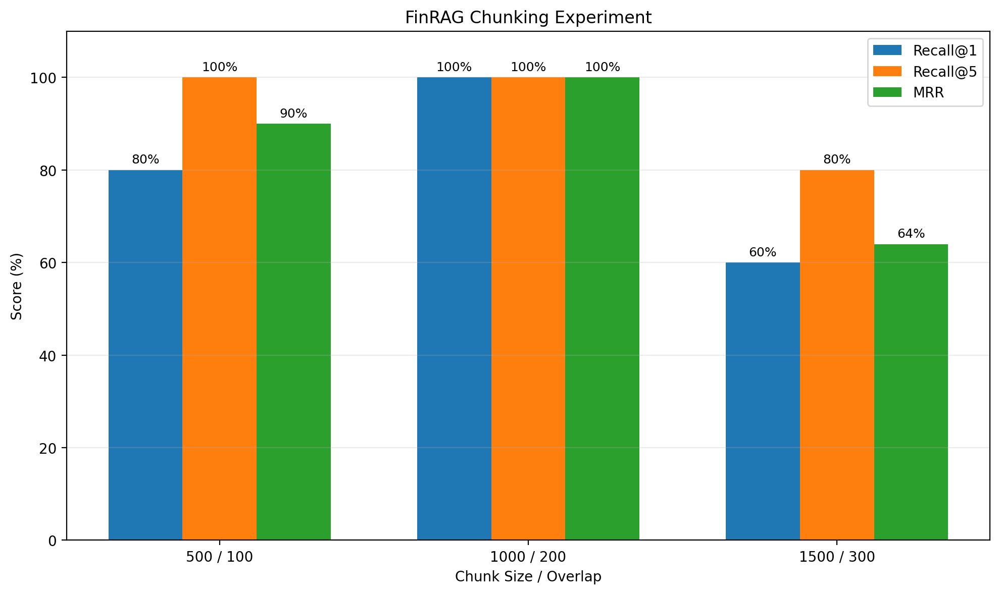

# 🏦 FinRAG — RBI Document Q&A

A local Retrieval-Augmented Generation (RAG) system for answering questions from an **RBI regulatory document** using semantic retrieval and a small local LLM.

The system processes the RBI PDF into searchable chunks, converts them into **Sentence Transformer embeddings**, stores them in **ChromaDB**, retrieves relevant context for a user query, and generates a grounded answer using **Llama 3.2 1B through Ollama**.

### Key Highlights

- **Document:** RBI Master Directions on Prepaid Payment Instruments
- **Document size:** 40 pages
- **Final chunks:** 135
- **Chunking:** 1,000 characters with 200-character overlap
- **Embedding model:** `sentence-transformers/all-MiniLM-L6-v2`
- **Embedding dimension:** 384
- **Vector database:** ChromaDB
- **Retrieval:** Top-1 semantic search with distance threshold
- **LLM:** Llama 3.2 1B running locally through Ollama
- **Interface:** Streamlit
- **Retrieval evaluation:** Recall@1, Recall@5 and MRR
- **Evaluation questions:** 5

### Retrieval Results

| Metric | Result |
|---|---:|
| Recall@1 | 100.00% |
| Recall@5 | 100.00% |
| MRR | 1.000 |

All five expected pages were retrieved at rank 1 on the current evaluation set.

> **Evaluation note:** These results are based on a small five-question evaluation set and should not be treated as a general benchmark for RBI documents.

---

## What I Built

The application follows a simple RAG pipeline:

```text
RBI PDF
   ↓
Load Pages
   ↓
Chunk Documents
   ↓
Create Embeddings
   ↓
Store in ChromaDB
   ↓
Retrieve Relevant Chunk
   ↓
Llama 3.2 1B
   ↓
Answer
```

---

## Technologies

- Python
- PyMuPDF
- LangChain
- Sentence Transformers
- ChromaDB
- Ollama
- Llama 3.2 1B
- Streamlit

---

## Why RAG?

Instead of sending the entire RBI PDF to the LLM, the application first searches the document for the most relevant information.

For each question:

1. Convert the question into an embedding.
2. Search ChromaDB for similar document chunks.
3. Reject chunks that are above the configured distance threshold.
4. Pass the relevant chunk to the local LLM.
5. Generate an answer using only the retrieved RBI context.

This keeps the LLM context small, focused, and grounded in the document.

---
## Architecture

The system follows a simple local RAG pipeline with separate flows for document indexing, question answering, and retrieval evaluation.


### Query Flow

1. The user enters an RBI-related question.
2. The question is converted into an embedding using `all-MiniLM-L6-v2`.
3. ChromaDB performs semantic similarity search.
4. The application retrieves the top-ranked chunk.
5. Results with a distance greater than `1.0` are rejected.
6. The relevant RBI context is passed to Llama 3.2 1B through Ollama.
7. The generated answer and source information are displayed through Streamlit.

### Evaluation Flow

The retrieval evaluation uses the same embedding model and ChromaDB collection, but retrieves the top 5 results for each evaluation question.

The system measures:

- Recall@1
- Recall@5
- Mean Reciprocal Rank (MRR)
---

## Document

The project currently uses an RBI document related to **Prepaid Payment Instruments (PPIs)**.

| Property | Value |
|---|---|
| Document format | PDF |
| Pages | 40 |

The PDF is loaded page by page so that the original page number can be preserved as metadata.

---

## Chunking

Each page is split into smaller chunks before creating embeddings.

Chunk size and overlap can significantly affect retrieval quality, so three configurations were tested on the evaluation set.



### Chunking Experiment

| Chunk Size | Overlap | Chunks | Recall@1 | Recall@5 | MRR |
|---:|---:|---:|---:|---:|---:|
| 500 | 100 | 266 | 80.00% | 100.00% | 0.900 |
| **1000** | **200** | **135** | **100.00%** | **100.00%** | **1.000** |
| 1500 | 300 | 95 | 60.00% | 80.00% | 0.640 |

### Why 1000 / 200 Was Selected

The **1000-character chunk size with 200-character overlap** performed best on the current evaluation set.

It achieved:

- **Recall@1: 100%**
- **Recall@5: 100%**
- **MRR: 1.000**

The 500-character configuration retrieved the correct result within the top 5 but performed worse at rank 1.

The 1500-character configuration showed a larger drop in retrieval quality, with Recall@1 decreasing to 60%.

Based on these results, the 1000/200 configuration was selected as the final chunking strategy.

> **Evaluation note:** The experiment is based on the current five-question evaluation set. These results should not be interpreted as a universal optimum for other RBI documents or larger datasets.

### Final Configuration

```text
Chunk size    : 1000 characters
Chunk overlap : 200 characters
Pages         : 40
Chunks        : 135

```

---

## Embeddings

The project uses:

```text
sentence-transformers/all-MiniLM-L6-v2
```

### Embedding Dimension

```text
384
```

The embeddings allow the system to search for information based on semantic similarity rather than only exact keyword matches.

---

## Vector Database

**ChromaDB** is used as the local vector database.

```text
Collection : rbi_documents
Chunks     : 135
```

The vector database is generated locally and is excluded from Git.

---

## Retrieval

The question is converted into an embedding and searched against the ChromaDB collection.

### Final Retrieval Configuration

```text
Top K              : 1
Distance threshold : 1.0
```

ChromaDB returns a distance value for each result.

```text
Lower distance  → More similar
Higher distance → Less similar
```

Only results satisfying:

```text
distance <= 1.0
```

are passed to the LLM.

This threshold helps prevent unrelated questions from reaching the answer-generation stage.

For example, an RBI question can produce a low distance such as:

```text
0.6151
```

while unrelated questions such as:

```text
What is the capital of France?
```

produce a much higher distance and are rejected.

---

## Answer Generation

The final answer is generated using:

```text
Llama 3.2 1B
llama3.2:1b-instruct-q3_K_M
```

The model runs locally through **Ollama**.

The model is intentionally small so that the application can run on CPU-based systems without requiring a large GPU.

The prompt instructs the model to:

- Use only the retrieved RBI text
- Answer directly
- Avoid outside knowledge
- Avoid inventing information
- Keep the answer concise

### Example

**Question**

> What is the maximum amount that can be loaded into such PPIs during a month?

**Retrieved context**

```text
Amount loaded in such PPIs during any month shall not exceed
Rs.10,000/-
```

**Answer**

> The maximum amount that can be loaded into such PPIs during a month is Rs.10,000.

---

## Handling Unrelated Questions

The system is designed to avoid answering questions that are unrelated to the RBI document.

For example:

```text
What is the capital of France?
```

The retrieval distance is above the configured threshold.

Therefore, the question is rejected before answer generation:

```text
I could not find the answer in the provided RBI document.
```

This keeps the application grounded in the retrieved RBI content.

---

## Streamlit Application

A simple Streamlit interface is included.

Run:

```bash
streamlit run app/streamlit_app.py
```

The application allows the user to:

- Enter an RBI question
- Retrieve the relevant RBI chunk
- Generate an answer locally
- See the RBI page used as the source
- See the retrieval distance

---

## Evaluation

Retrieval quality was evaluated separately from LLM answer generation.

The final 1000-character chunk size with 200-character overlap, selected through the chunking experiment, retrieved the expected source page at rank 1 for all five evaluation questions on the current evaluation set.

### Evaluation Questions

| # | Question | Expected Page |
|---:|---|---:|
| 1 | What is the maximum amount that can be loaded into such PPIs during a month? | 9 |
| 2 | What is the maximum amount that can remain outstanding in such PPIs at any point in time? | 9 |
| 3 | What is the monthly limit for funds transfer from such PPIs? | 10 |
| 4 | What is the maximum cash withdrawal limit for non-bank issued PPIs? | 11 |
| 5 | What does the term PPI Holder mean? | 2 |


### Retrieval Evaluation

Run:

```bash
python evaluation/evaluate_retrieval.py
```

Result:

```text
Correct: 5/5
Recall@5: 100.00%
```

### Ranking Evaluation

Run:

```bash
python evaluation/evaluate_ranking.py
```

Result:

```text
Recall@1 : 100.00%
Recall@5 : 100.00%
MRR      : 1.000
```

All five expected pages were retrieved at rank 1.

### Final Evaluation Summary

| Metric | Result |
|---|---:|
| Evaluation questions | 5 |
| Recall@1 | 100.00% |
| Recall@5 | 100.00% |
| MRR | 1.000 |
| Document pages | 40 |
| Final chunks | 135 |

These results are based on the current evaluation set and should not be considered a general benchmark for all RBI documents.

---

## Project Structure

```text
finrag-rbi-document-qa/
│
├── app/
│   └── streamlit_app.py
│
├── data/
│   └── documents/
│       └── rbi_prepaid_payment_instruments.pdf
│
├── evaluation/
│   ├── questions.json
│   ├── evaluate_retrieval.py
│   ├── evaluate_ranking.py
│   └── chunking_experiment.py
│
├── screenshots/
│   ├── application/
│   ├── retrieval/
│   ├── evaluation/
│   └── chunking/
│
├── src/
│   ├── load_documents.py
│   ├── chunk_documents.py
│   ├── build_vector_db.py
│   ├── retrieve.py
│   └── generate_answer.py
│
├── .gitignore
├── README.md
└── requirements.txt
```

---

## Installation

### 1. Clone the Repository

```bash
git clone https://github.com/Mohanaspiringcoder/finrag-rbi-document-qa.git
cd finrag-rbi-document-qa
```

### 2. Create a Virtual Environment

```bash
python3 -m venv .venv
source .venv/bin/activate
```

### 3. Install Dependencies

```bash
pip install -r requirements.txt
```

### 4. Install and Run Ollama

Install Ollama for your operating system, then pull the local model:

```bash
ollama pull llama3.2:1b-instruct-q3_K_M
```

Verify:

```bash
ollama list
```

---

## Run the Project

Run these steps in order.

### 1. Load the Document

```bash
python src/load_documents.py
```

Expected:

```text
Number of pages loaded: 40
```

### 2. Create Chunks

```bash
python src/chunk_documents.py
```

Expected:

```text
Pages loaded: 40
Chunks created: 135
```

### 3. Build the Vector Database

```bash
python src/build_vector_db.py
```

Expected:

```text
Embeddings shape: (135, 384)
Stored chunks: 135
```

### 4. Test Retrieval

```bash
python src/retrieve.py
```

### 5. Run Terminal Q&A

```bash
python -m src.generate_answer
```

### 6. Run Streamlit

```bash
streamlit run app/streamlit_app.py
```

---

## Run Evaluation

### Retrieval

```bash
python evaluation/evaluate_retrieval.py
```

### Ranking

```bash
python evaluation/evaluate_ranking.py
```

### Chunking Experiment

```bash
python evaluation/chunking_experiment.py
```

---

## Screenshots

Screenshots from the development and evaluation process are stored in:

```text
screenshots/
```

The folders contain examples of:

- Streamlit application
- Successful RBI question answering
- Rejection of unrelated questions
- Retrieval results
- Retrieval evaluation
- Ranking evaluation
- Chunking experiments

---

## Limitations

This project is intentionally designed as a small local RAG application, so the current implementation has several limitations.

### Evaluation Scope

- The retrieval evaluation contains only **five questions**.
- Only **one RBI document** is currently indexed.
- The current results should therefore be treated as an initial project-level evaluation rather than a general benchmark for RBI documents.

### Retrieval Limitations

- The production retrieval configuration retrieves only **one chunk** for answer generation.
- Retrieval quality depends on the selected embedding model and chunking strategy.
- The distance threshold of **1.0** was selected using the current document and evaluation set and would require broader validation on a larger corpus.
- Questions requiring information from multiple sections may benefit from retrieving and combining multiple chunks.

### Generation Limitations

- The application uses a small **Llama 3.2 1B** model to keep the system lightweight and locally runnable.
- A small model may struggle with complex, multi-part, or reasoning-heavy questions even when the retrieved context is relevant.
- The system is designed to ground answers in retrieved document context, but answer quality still depends on both retrieval quality and the capabilities of the local LLM.

### Document Processing Limitations

- The current system works with a single PDF document.
- Complex PDF tables, layouts, or other difficult document structures may require more advanced extraction techniques.
- The current evaluation does not comprehensively test noisy, ambiguous, multi-hop, or complex question types.

These limitations define the current scope of the project and provide clear areas for future improvement.

---

## Key Learnings

This project helped me understand the complete RAG pipeline from document ingestion to answer generation.

The main lessons were:

- Chunk size has a significant impact on retrieval quality.
- Smaller chunks do not always produce better retrieval.
- Chunk overlap helps preserve context across boundaries.
- Semantic search is useful for document question answering.
- Retrieval should be evaluated separately from answer generation.
- A small local LLM can work well when the retrieved context is relevant.
- A retrieval threshold can help prevent unrelated questions from reaching the LLM.
- Sending only relevant context keeps the LLM input smaller and focused.

---

## Future Improvements

The current implementation provides a simple and measurable foundation for local RBI document question answering. The following improvements would extend the system toward a more robust and production-oriented RAG pipeline.

### 1. Expand the RBI Document Corpus

- Index multiple RBI documents instead of a single document.
- Store document-level metadata such as document name, category, and publication information.
- Support filtering retrieval by document or regulatory topic.

### 2. Build a Larger Evaluation Dataset

- Increase the number of evaluation questions beyond the current five.
- Cover different question types, including factual, comparative, multi-part, and out-of-scope questions.
- Evaluate retrieval across multiple RBI documents and source locations.

### 3. Retrieve Multiple Chunks

- Extend the current Top-1 retrieval approach to retrieve multiple relevant chunks when a question requires information from different parts of a document.
- Experiment with different values of `k` and evaluate their effect on retrieval quality and answer generation.

### 4. Add Hybrid Retrieval

- Combine semantic vector search with keyword-based retrieval such as BM25.
- Compare semantic-only and hybrid retrieval on the same evaluation dataset.
- Use hybrid retrieval for queries where exact regulatory terms or phrases are important.

### 5. Add a Reranking Stage

- Retrieve a larger candidate set from ChromaDB.
- Apply a cross-encoder or other reranking model to reorder the candidates.
- Evaluate whether reranking improves Recall@1, Recall@5, and MRR.

### 6. Experiment with Stronger Embedding Models

- Compare `all-MiniLM-L6-v2` with stronger open-source embedding models.
- Evaluate embedding quality using the same questions, documents, and metrics.
- Select the model based on retrieval performance and local resource requirements.

### 7. Improve PDF and Table Extraction

- Investigate more robust document parsing for complex PDF layouts.
- Improve handling of tables, structured content, and information that spans multiple sections.
- Preserve richer document metadata for more precise source attribution.

### 8. Improve Source Citations

- Return clearer document and page references with every generated answer.
- Make the retrieved source context easier for users to inspect.
- Add validation to ensure generated answers are supported by the retrieved document content.

### 9. Expand RAG Evaluation

- Evaluate retrieval and generation separately.
- Add larger and more diverse test sets.
- Track retrieval metrics such as Recall@1, Recall@5, and MRR alongside answer-quality metrics.
- Include failure-case analysis to understand where retrieval or generation breaks down.

---

## Final Configuration

| Component | Configuration |
|---|---|
| Document | RBI PPI document |
| Pages | 40 |
| Chunk size | 1000 characters |
| Chunk overlap | 200 characters |
| Chunks | 135 |
| Embedding model | all-MiniLM-L6-v2 |
| Embedding dimension | 384 |
| Vector database | ChromaDB |
| Top K | 1 |
| Distance threshold | 1.0 |
| LLM | Llama 3.2 1B |
| LLM runtime | Ollama |
| Interface | Streamlit |

---

## Author

**Mohan**

GitHub: [@Mohanaspiringcoder](https://github.com/Mohanaspiringcoder)
